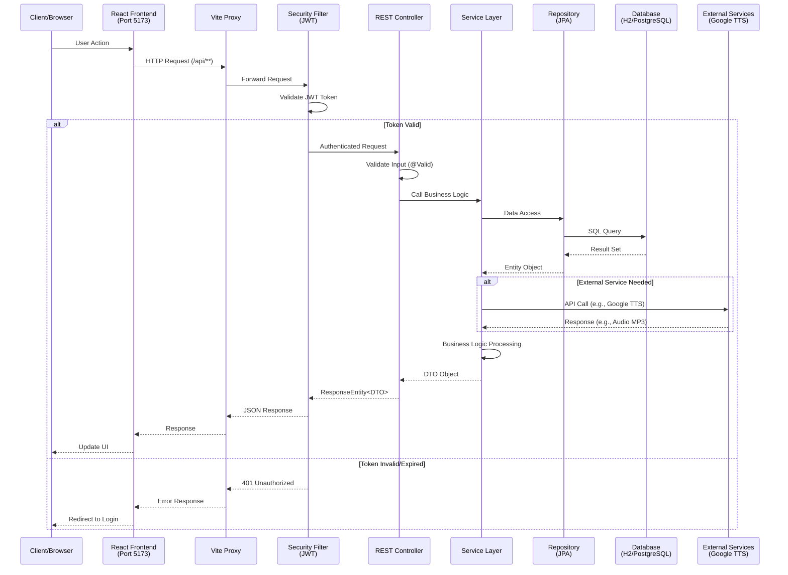
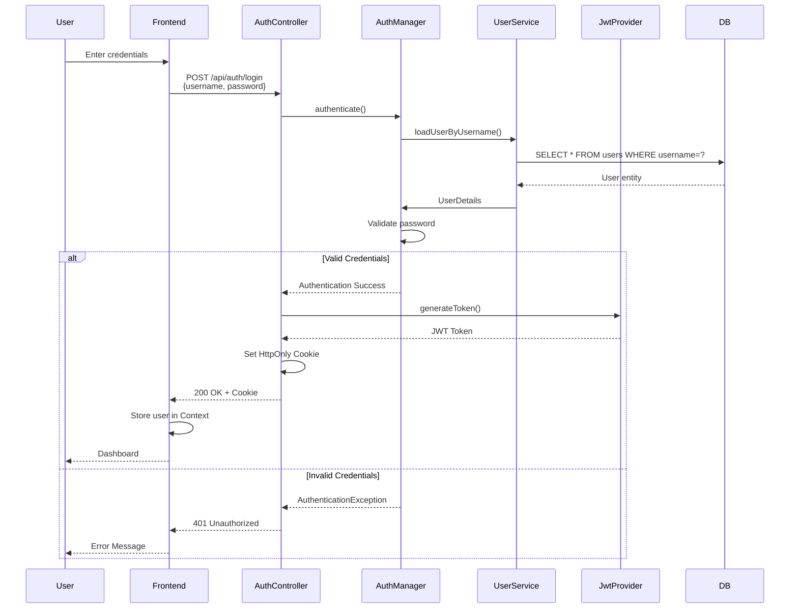
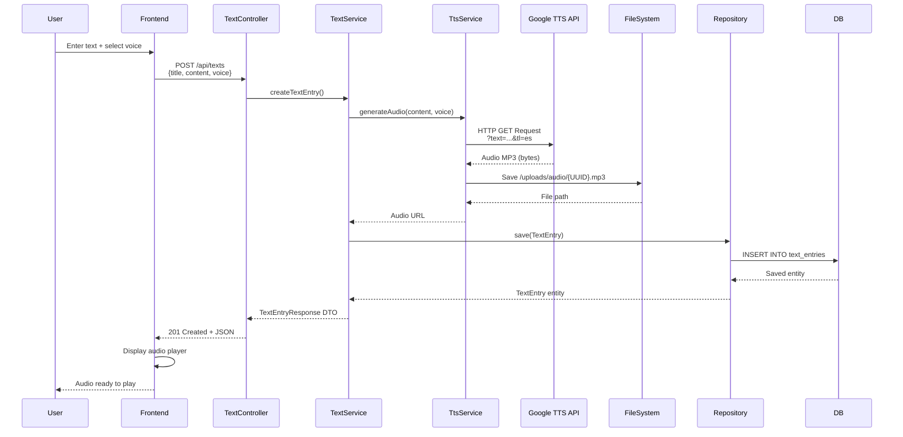
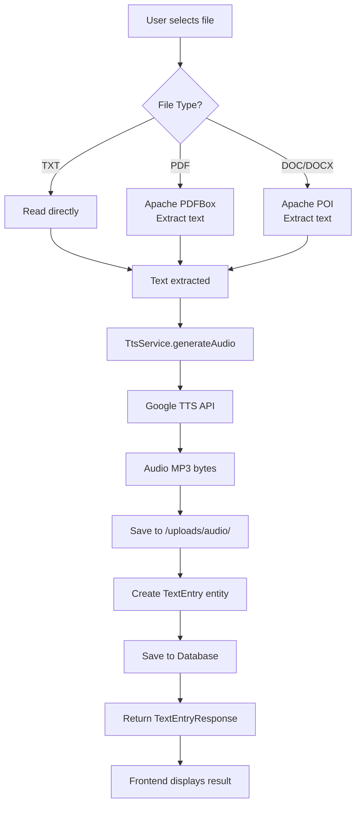
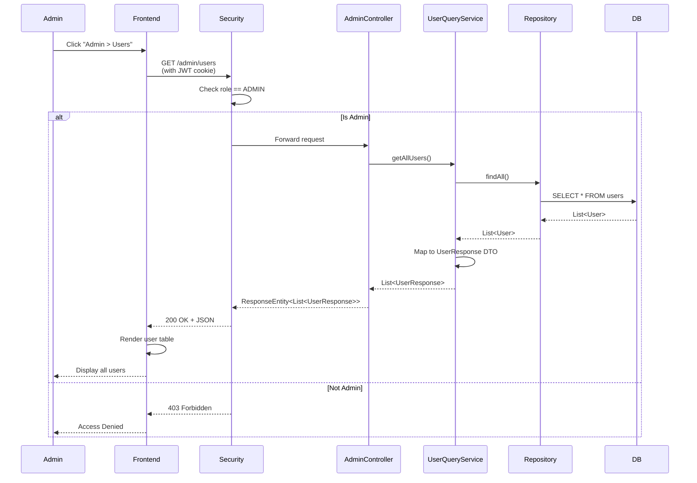
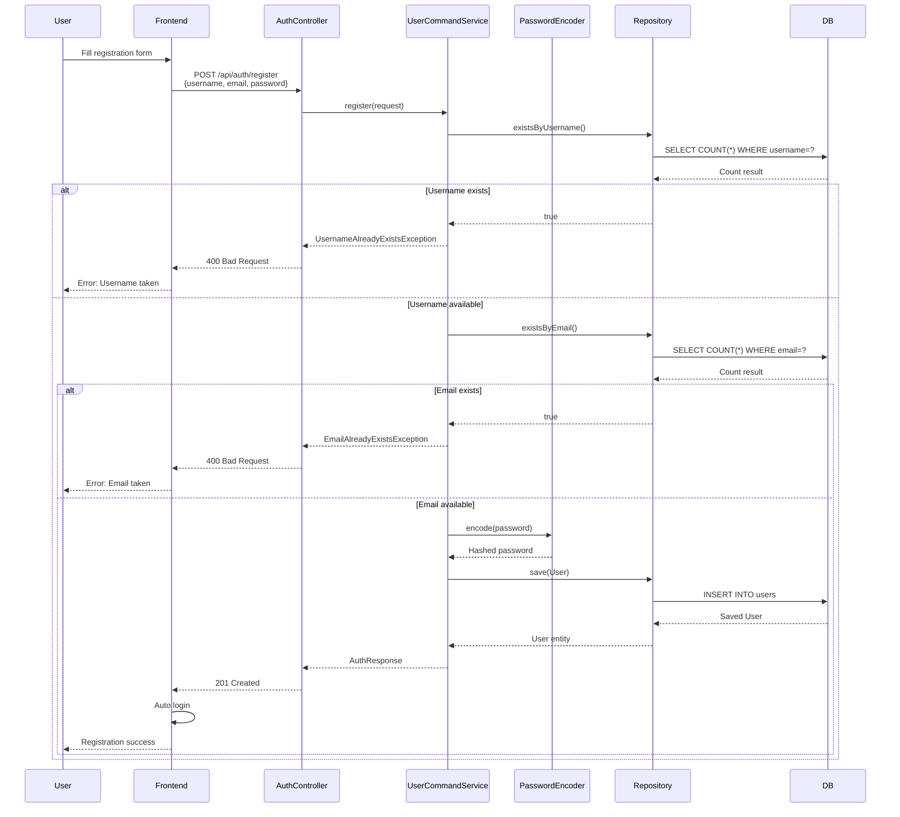
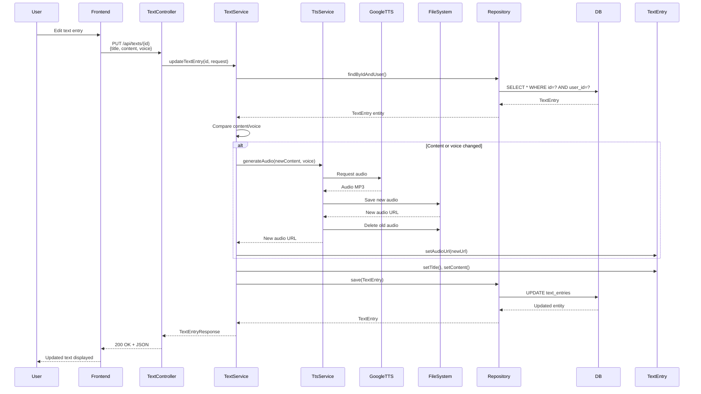
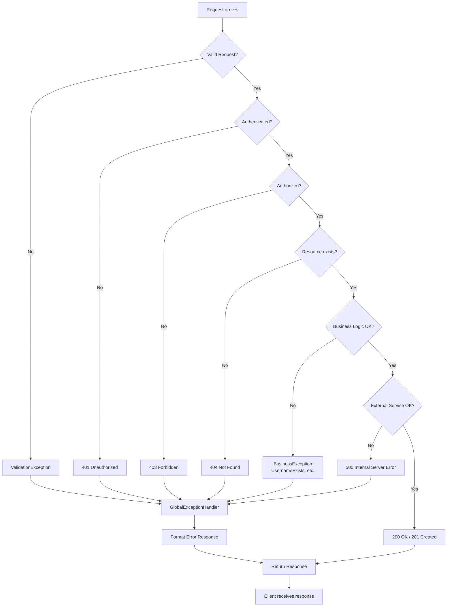

# 🔄 API Flow Diagrams - TTS App

## Complete API Request Flow

## Authentication Flow

## Text-to-Speech Flow

## File Upload Flow

## Admin Panel Flow

## Registration Flow

## Update Text Entry Flow

## Error Handling Flow

## API Endpoint Summary

### Public Endpoints (No Authentication)

- `POST /api/auth/register` - Register new user
- `POST /api/auth/login` - Login (returns JWT cookie)
- `GET /swagger-ui.html` - API documentation

### Protected Endpoints (Require Authentication)

**User Endpoints:**
- `GET /api/auth/me` - Get current user
- `POST /api/auth/logout` - Logout
- `GET /api/texts` - List user's texts
- `POST /api/texts` - Create text entry
- `POST /api/texts/upload` - Upload file
- `PUT /api/texts/{id}` - Update text entry
- `GET /api/texts/{id}` - Get text entry
- `DELETE /api/texts/{id}` - Delete text entry
- `GET /api/tts/speak` - Generate audio (streaming)
- `GET /uploads/audio/{filename}` - Serve audio file

**Admin Endpoints (Require ADMIN role):**
- `GET /admin/users` - List all users
- `DELETE /admin/users/{id}` - Delete user
- `GET /admin/texts` - List all texts
- `DELETE /admin/texts/{id}` - Delete any text
- `GET /admin/files` - List all audio files
- `DELETE /admin/files` - Delete audio file

## Notes

- **JWT Token**: Stored in HttpOnly cookie, automatically sent with each request
- **CORS**: Configured for `http://localhost:5173` (frontend)
- **Proxy**: Vite proxy redirects `/api/**` to `http://localhost:8080`
- **Error Handling**: Global exception handler formats all errors consistently
- **Validation**: Input validation using `@Valid` and custom validators
- **Security**: Role-based access control (RBAC) for admin endpoints

