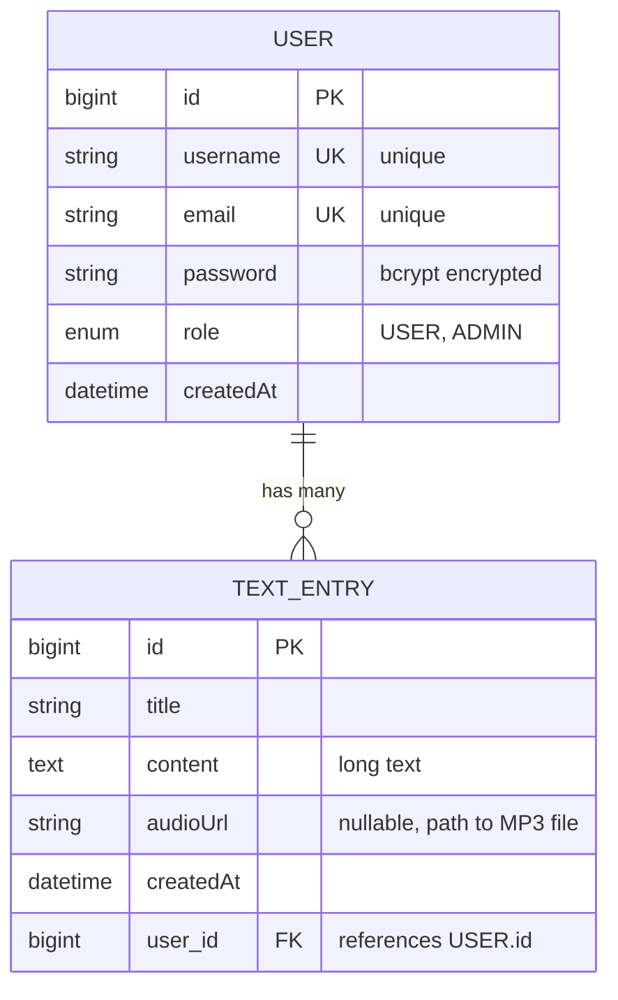

# 📊 Database Diagram - TTS App

## Entity Relationship Diagram (ERD)



## Database Schema Details

### Table: `users`

| Column | Type | Constraints | Description |
|--------|------|-------------|-------------|
| `id` | BIGINT | PRIMARY KEY, AUTO_INCREMENT | Unique identifier |
| `username` | VARCHAR(50) | UNIQUE, NOT NULL | Username for login |
| `email` | VARCHAR(100) | UNIQUE, NOT NULL | User email address |
| `password` | VARCHAR(255) | NOT NULL | Bcrypt hashed password |
| `role` | ENUM('USER', 'ADMIN') | NOT NULL, DEFAULT 'USER' | User role |
| `created_at` | TIMESTAMP | NOT NULL, DEFAULT CURRENT_TIMESTAMP | Registration date |

**Indexes:**
- Primary Key: `id`
- Unique: `username`
- Unique: `email`

### Table: `text_entries`

| Column | Type | Constraints | Description |
|--------|------|-------------|-------------|
| `id` | BIGINT | PRIMARY KEY, AUTO_INCREMENT | Unique identifier |
| `title` | VARCHAR(255) | NOT NULL | Text entry title |
| `content` | TEXT | NOT NULL | Text content (long text) |
| `audio_url` | VARCHAR(500) | NULLABLE | Path to generated MP3 file |
| `created_at` | TIMESTAMP | NOT NULL, DEFAULT CURRENT_TIMESTAMP | Creation date |
| `user_id` | BIGINT | FOREIGN KEY, NOT NULL | Reference to users.id |

**Indexes:**
- Primary Key: `id`
- Foreign Key: `user_id` → `users.id` (ON DELETE CASCADE)

## Relationships

### USER → TEXT_ENTRY (One-to-Many)

- **Type**: One-to-Many
- **Cardinality**: One USER can have many TEXT_ENTRY
- **Cascade**: When a USER is deleted, all their TEXT_ENTRY are deleted
- **JPA Mapping**: `@OneToMany(mappedBy = "user", cascade = CascadeType.ALL)`

### TEXT_ENTRY → USER (Many-to-One)

- **Type**: Many-to-One
- **Cardinality**: Many TEXT_ENTRY belong to one USER
- **JPA Mapping**: `@ManyToOne(fetch = FetchType.LAZY)`

## Sample Data

### Users Table

```sql
INSERT INTO users (username, email, password, role, created_at) VALUES
('admin', 'admin@ttsapp.com', '$2a$10$...', 'ADMIN', '2025-11-15 10:00:00'),
('john_doe', 'john@example.com', '$2a$10$...', 'USER', '2025-11-16 14:30:00');
```

### Text Entries Table

```sql
INSERT INTO text_entries (title, content, audio_url, user_id, created_at) VALUES
('Mi primer texto', 'Hola mundo, este es mi primer texto...', '/uploads/audio/a3f5b2c1.mp3', 2, '2025-11-16 15:00:00'),
('Documento importante', 'Este es un documento importante...', '/uploads/audio/d4e6f7g8.mp3', 2, '2025-11-16 16:00:00');
```

## Database Configuration

### Development (H2 - File-based)

```yaml
spring:
  datasource:
    url: jdbc:h2:file:./data/ttsdb
    driver-class-name: org.h2.Driver
    username: sa
    password: 
```

**File Location**: `./data/ttsdb.mv.db`

### Production (PostgreSQL)

```yaml
spring:
  datasource:
    url: jdbc:postgresql://localhost:5432/ttsdb
    driver-class-name: org.postgresql.Driver
    username: ${DB_USERNAME}
    password: ${DB_PASSWORD}
```

## JPA Entity Configuration

### User Entity

```java
@Entity
@Table(name = "users")
public class User {
    @Id
    @GeneratedValue(strategy = GenerationType.IDENTITY)
    private Long id;
    
    @Column(unique = true, nullable = false)
    private String username;
    
    @Column(unique = true, nullable = false)
    private String email;
    
    @Column(nullable = false)
    private String password; // bcrypt
    
    @Enumerated(EnumType.STRING)
    @Column(nullable = false)
    private Role role;
    
    @OneToMany(mappedBy = "user", cascade = CascadeType.ALL, fetch = FetchType.LAZY)
    private List<TextEntry> textEntries;
    
    @Column(nullable = false, updatable = false)
    private LocalDateTime createdAt;
}
```

### TextEntry Entity

```java
@Entity
@Table(name = "text_entries")
public class TextEntry {
    @Id
    @GeneratedValue(strategy = GenerationType.IDENTITY)
    private Long id;
    
    @Column(nullable = false)
    private String title;
    
    @Column(nullable = false, columnDefinition = "TEXT")
    private String content;
    
    @Column(name = "audio_url")
    private String audioUrl;
    
    @ManyToOne(fetch = FetchType.LAZY)
    @JoinColumn(name = "user_id", nullable = false)
    private User user;
    
    @Column(nullable = false, updatable = false)
    private LocalDateTime createdAt;
}
```

## Database Queries Examples

### Get all users with their text count

```sql
SELECT 
    u.id,
    u.username,
    u.email,
    u.role,
    COUNT(te.id) as text_count
FROM users u
LEFT JOIN text_entries te ON u.id = te.user_id
GROUP BY u.id, u.username, u.email, u.role;
```

### Get all texts with user information

```sql
SELECT 
    te.id,
    te.title,
    te.content,
    te.audio_url,
    te.created_at,
    u.username,
    u.email
FROM text_entries te
INNER JOIN users u ON te.user_id = u.id
ORDER BY te.created_at DESC;
```

### Get user's texts

```sql
SELECT * FROM text_entries 
WHERE user_id = ? 
ORDER BY created_at DESC;
```

## Notes

- **Cascade Delete**: When a user is deleted, all their text entries are automatically deleted
- **Lazy Loading**: Text entries are loaded lazily to improve performance
- **Indexes**: Username and email are indexed for fast lookups
- **File Storage**: Audio files are stored in `/uploads/audio/` directory, not in database
- **H2 Console**: Available at `http://localhost:8080/h2-console` in development mode

